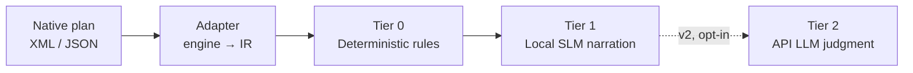

# QuerySmith

[](LICENSE)

**Your query execution plan, explained in plain English — for free, offline, before you ever page an on-call DBA.**

QuerySmith connects to a database, pulls the execution plan for a query (or a stored procedure, function, trigger, or view), and runs it through a tiered analysis pipeline that catches the obvious problems deterministically and narrates them in plain English — no cloud API key required to get started.

## Origin story

This started as interview prep. Reading SQL Server execution plans was a gap — years of persistence-layer work meant mostly basic queries and client-side shaping, never much time spent staring at operator trees. While prepping, feeding plan XML into an LLM for interpretation turned out to be genuinely useful. QuerySmith turns that ad hoc workflow into a proper tool.

## How it works

Every engine gets a thin adapter that parses its native plan format into one dialect-agnostic **intermediate representation (IR)** — an operator tree with type, table, row estimates, cost, predicates, and warnings. Everything downstream — the rules engine, the model prompts — operates on the IR and never touches raw engine output.



| Tier | What it does | Cost |
|---|---|---|
| **0 — Rules engine** | Scans vs. seeks on large tables, cardinality skew, tempdb spills, missing covering indexes, implicit conversions, parallelism warnings — the deterministic, trustworthy backbone | Free, instant, always runs |
| **1 — Local SLM** | Explains Tier 0's findings in plain English and presents them in order — narration only, never reprioritizes | Free, local, runs by default |
| **2 — API LLM** *(v2, deferred)* | Genuine tradeoff judgment — index write-cost vs. benefit, parameter-sniffing vs. bad plan, semantic safety of a rewrite | Opt-in, your API key |

**Read-only by design.** QuerySmith never applies a fix — suggestions come out as scripts for a human to review. Enforced in layers: a DB login scoped to read-only permissions, fixed statement templates instead of string concatenation, and parser-based validation that a submitted statement is genuinely read-only shape before anything is sent.

## Status

- [x] Intermediate representation (IR) schema
- [x] SQL Server plan-XML → IR adapter
- [x] Tier 0 deterministic rules engine
- [x] Tier 1 local SLM narration
- [x] CLI (`querysmith`)
- [x] Local web UI (`querysmith-web`) — v1: connection wizard, view browser, free-text query, a Suggested Fixes panel, and an on-demand Propose Fix step. Built, unit-tested, and exercised against a live SQL Server instance (see `design-notes/execution-plan-web-ui.md`)
- [ ] PostgreSQL / MySQL / SQLite adapters
- [ ] Tier 2 API LLM tier (v2)

SQL Server is the v1 target — richest plan structure, real actual-execution data via `STATISTICS XML ON`. PostgreSQL is next (best-instrumented after SQL Server, validates the abstraction generalizes), then thinner MySQL/SQLite adapters once the pattern holds. NoSQL is explicitly out of scope — a different cost model (index selection / RU consumption) doesn't fit the same abstraction.

## Quick start

```bash
python3 -m venv .venv
source .venv/bin/activate
pip install -e . -r requirements-dev.txt
pytest -v
```

## Usage (CLI)

`pip install -e .` installs a `querysmith` command that connects live to a SQL
Server instance, captures an execution plan for an ad-hoc `SELECT` query, and
prints the full Tier 0 + Tier 1 report:

```bash
export QUERYSMITH_DB_PASSWORD='your-password'   # never pass it as a flag
querysmith --server 192.168.1.84,1433 --database AdventureWorks2025 \
  --user your_login --query "SELECT * FROM dbo.SomeView"
```

The query must parse as a single read-only `SELECT` statement (validated via
`sqlglot` before anything is sent to the server — stacked statements,
`INSERT`/`UPDATE`/`DELETE`/`EXEC`, and comment-obfuscated attempts are all
rejected). Useful flags: `--no-narrate` for fast Tier-0-only output,
`--model`/`--ollama-timeout` to point at a different local model, `--timeout`
for the DB connection, `--no-trust-server-certificate` if your instance has a
CA-signed cert. Run `querysmith --help` for the full list.

## Usage (Web UI)

`pip install -e .` also installs a `querysmith-web` command — a local
browser UI for the same connect → capture → analyze flow, for when typing
a full CLI invocation for every query gets old:

```bash
querysmith-web                      # binds 127.0.0.1:8420 by default
querysmith-web --port 8080 --reload # custom port, auto-reload for dev
```

Open the printed URL in a browser. The flow: a connection wizard (server,
port, database, user, password, driver — never passed on a command line,
with a live countdown while it connects), followed by a single screen
with a sidebar of the connected database's views and a free-text query
box. Clicking a view fills the query box with the view's own defining
query (extracted from its SQL Server definition), falling back to
`SELECT * FROM schema.view` for encrypted or unparseable views; there's
no separate "run this view" path either way — everything funnels through
the same validated, read-only query flow the CLI uses. Findings render as
severity-colored cards with Tier 1 narration, and every fix for the run —
Tier 0's own scripts and Tier 1's suggestions — collects into a
**Suggested Fixes** panel, each as an inert, read-only, copy-to-clipboard
card.

A **Propose Fix** button in that panel triggers a second, on-demand model
call asking specifically for a rewritten query and/or a `CREATE INDEX`
script per finding — kept separate from the main query flow since
drafting SQL is a much slower ask for a small local model than a one-line
explanation, and most runs don't need it. Both proposed fixes are
re-validated (single `SELECT` / single `CREATE INDEX`) before ever being
shown, same as everything else in this UI: suggested, never applied.

v1 scope is intentionally narrow: views + freeform queries only (no
stored procedures/triggers/functions yet — see
`design-notes/execution-plan-web-ui.md` for why), and one connection at a
time (no concurrent multi-client sessions, no auth layer — this is a
local, single-user tool). The API surface (`/api/connection`, `/api/views`,
`/api/query`, `/api/propose-fix`) is plain JSON over HTTP, so it's also
intended to be reused by a possible future VS Code extension rather than
being UI-only.

## Tier 1 setup (optional, local)

Tier 0 (the rules engine) works standalone with no setup. Tier 1 narration is
additive: if no local model is running, `get_narration` degrades gracefully
and falls back to Tier 0's own plain-English `summary`/`detail` text.

To run a real local model:

```bash
docker compose up -d
docker compose exec ollama ollama pull llama3.2:3b   # default -- on 8GB-RAM CPU-only boxes, an 8B model will OOM
```

The model name is a runtime parameter to `get_narration(..., model=...)`, not
hardcoded — swap it freely to compare candidates on your own hardware.

## Project layout

```
src/querysmith/
├── ir/                    # dialect-agnostic intermediate representation
├── adapters/
│   └── sqlserver/         # showplan XML -> IR
├── rules/                 # Tier 0: deterministic findings from the IR
├── narration/             # Tier 1: local-model narration of Tier 0's findings
│   ├── engine.py          # get_narration: explanation + overview, every query run
│   └── fix_engine.py      # propose_fixes: rewritten query / index script, on-demand only
├── db/                    # live SQL Server connectivity + statement-safety validation
│   ├── catalog.py         # fixed-template view listing for the web UI
│   └── query_safety.py    # validate_select_only / validate_create_index_only
├── web/                   # local web UI: FastAPI app + static frontend
│   ├── app.py             # `/api/connection`, `/api/views`, `/api/query`, `/api/propose-fix`
│   ├── session.py         # in-memory single-connection session store
│   ├── last_result.py     # caches the last query's findings for Propose Fix
│   ├── schemas.py         # pydantic request/response models
│   ├── server.py          # `querysmith-web` command
│   └── static/            # vanilla HTML/CSS/JS frontend, no build step
└── cli.py                 # `querysmith` command
tests/
├── fixtures/sqlserver/    # representative captured-plan XML
├── adapters/sqlserver/
├── rules/
├── narration/
├── db/
├── web/
└── cli/
```
