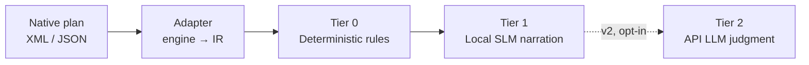

# QuerySmith

[](LICENSE)

**Your query execution plan, explained in plain English — for free, offline, before you ever page an on-call DBA.**

QuerySmith connects to a database, pulls the execution plan for a query (or a stored procedure, function, trigger, or view), and runs it through a tiered analysis pipeline that catches the obvious problems deterministically and narrates them in plain English — no cloud API key required to get started.

## Origin story

This started as interview prep. Reading SQL Server execution plans was a gap — years of persistence-layer work meant mostly basic queries and client-side shaping, never much time spent staring at operator trees. While prepping, feeding plan XML into an LLM for interpretation turned out to be genuinely useful. QuerySmith turns that ad hoc workflow into a proper tool.

## How it works

Every engine gets a thin adapter that parses its native plan format into one dialect-agnostic **intermediate representation (IR)** — an operator tree with type, table, row estimates, cost, predicates, and warnings. Everything downstream — the rules engine, the model prompts — operates on the IR and never touches raw engine output.



| Tier | What it does | Cost |
|---|---|---|
| **0 — Rules engine** | Scans vs. seeks on large tables, cardinality skew, tempdb spills, missing covering indexes, implicit conversions, parallelism warnings — the deterministic, trustworthy backbone | Free, instant, always runs |
| **1 — Local SLM** | Explains Tier 0's findings in plain English and presents them in order — narration only, never reprioritizes | Free, local, runs by default |
| **2 — API LLM** *(v2, deferred)* | Genuine tradeoff judgment — index write-cost vs. benefit, parameter-sniffing vs. bad plan, semantic safety of a rewrite | Opt-in, your API key |

**Read-only by design.** QuerySmith never applies a fix — suggestions come out as scripts for a human to review. Enforced in layers: a DB login scoped to read-only permissions, fixed statement templates instead of string concatenation, and parser-based validation that a submitted statement is genuinely read-only shape before anything is sent.

## Status

- [x] Intermediate representation (IR) schema
- [x] SQL Server plan-XML → IR adapter
- [x] Tier 0 deterministic rules engine
- [x] Tier 1 local SLM narration
- [ ] PostgreSQL / MySQL / SQLite adapters
- [ ] Tier 2 API LLM tier (v2)

SQL Server is the v1 target — richest plan structure, real actual-execution data via `STATISTICS XML ON`. PostgreSQL is next (best-instrumented after SQL Server, validates the abstraction generalizes), then thinner MySQL/SQLite adapters once the pattern holds. NoSQL is explicitly out of scope — a different cost model (index selection / RU consumption) doesn't fit the same abstraction.

## Quick start

```bash
python3 -m venv .venv
source .venv/bin/activate
pip install -e . -r requirements-dev.txt
pytest -v
```

## Tier 1 setup (optional, local)

Tier 0 (the rules engine) works standalone with no setup. Tier 1 narration is
additive: if no local model is running, `get_narration` degrades gracefully
and falls back to Tier 0's own plain-English `summary`/`detail` text.

To run a real local model:

```bash
docker compose up -d
docker compose exec ollama ollama pull llama3.1:8b   # or qwen2.5 / phi-4 -- try a few
```

The model name is a runtime parameter to `get_narration(..., model=...)`, not
hardcoded — swap it freely to compare candidates on your own hardware.

## Project layout

```
src/querysmith/
├── ir/                    # dialect-agnostic intermediate representation
├── adapters/
│   └── sqlserver/         # showplan XML -> IR
├── rules/                 # Tier 0: deterministic findings from the IR
└── narration/             # Tier 1: local-model narration of Tier 0's findings
tests/
├── fixtures/sqlserver/    # representative captured-plan XML
├── adapters/sqlserver/
├── rules/
└── narration/
```
